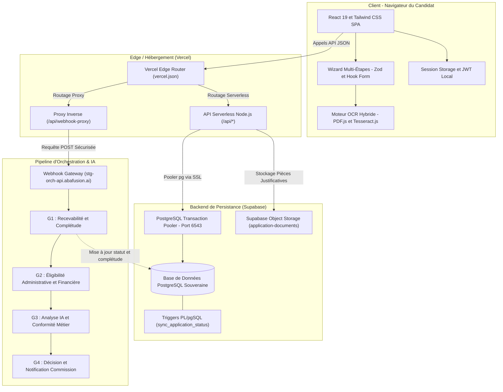
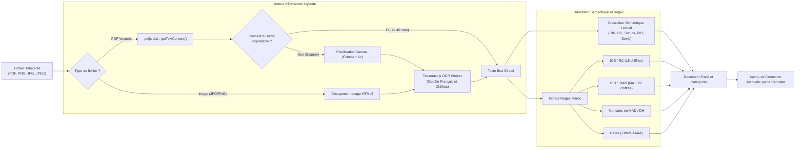
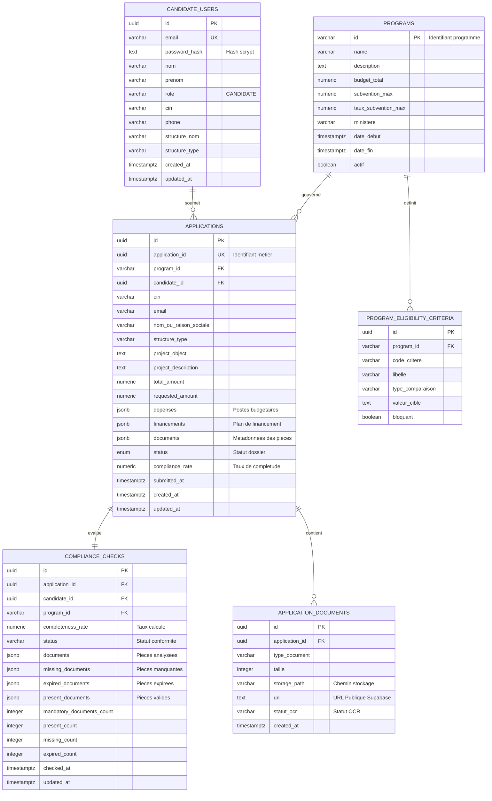
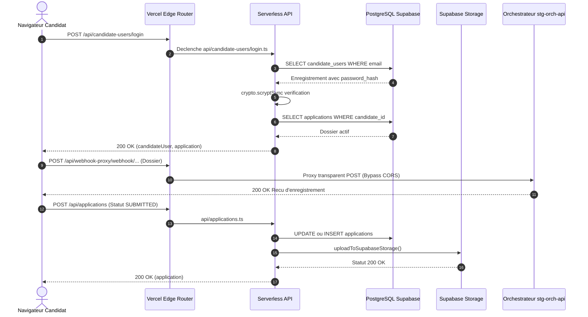
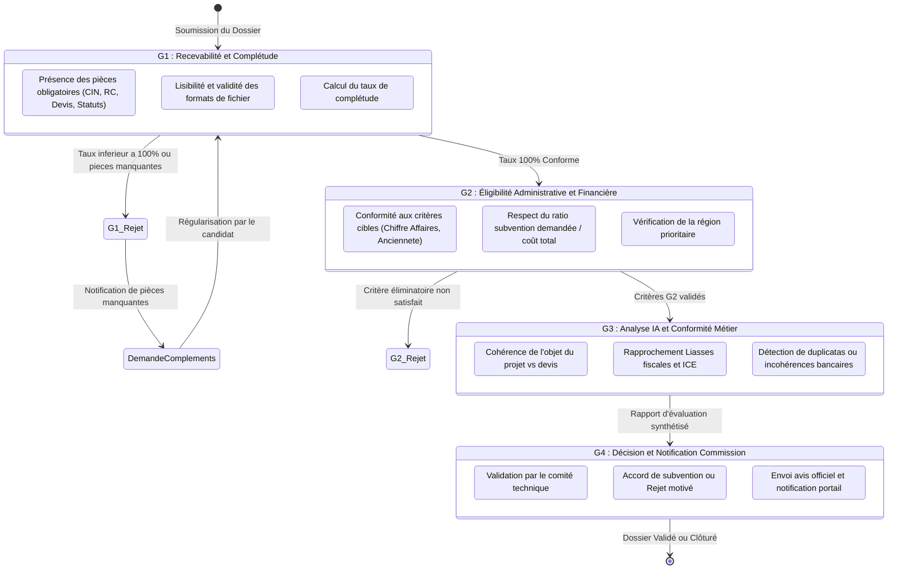

# 🏛️ SubVerif — Espace Candidature : Documentation Technique & Fonctionnelle Exhaustive

> **Plateforme Nationale Souveraine de Dématérialisation, d'Instruction et de Vérification des Dossiers de Subvention du Royaume du Maroc.**

---

## 📑 Sommaire

1. [Vue d'Ensemble & Vision Produit](#1-vue-densemble--vision-produit)
2. [Architecture Globale du Système](#2-architecture-globale-du-système)
3. [Cycle de Vie d'un Dossier & Parcours Utilisateur](#3-cycle-de-vie-dun-dossier--parcours-utilisateur)
4. [Le Pipeline OCR Souverain Côté Client](#4-le-pipeline-ocr-souverain-côté-client)
5. [Modèle de Données & Schéma PostgreSQL Supabase](#5-modèle-de-données--schéma-postgresql-supabase)
6. [Couche API Serverless (Vercel & Vite)](#6-couche-api-serverless-vercel--vite)
7. [Matrice des Niveaux d'Orchestration (G1 ➔ G4)](#7-matrice-des-niveaux-dorchestration-g1--g4)
8. [Sécurité, Cryptographie & Conformité Souveraine](#8-sécurité-cryptographie--conformité-souveraine)
9. [Guide Développeur, Scripts & Déploiement Vercel](#9-guide-développeur-scripts--déploiement-vercel)

---

## 1. Vue d'Ensemble & Vision Produit

**SubVerif (Espace Candidature)** est le portail public dédié aux porteurs de projets (entreprises, coopératives, indépendants, startups, associations) sollicitant des aides et financements publics de l'État marocain (programmes *Forsa*, *Tatwir R&D*, *Istitmar TPE*, *Intelaka Rural*, *Green Invest*, *Maroc PME*, etc.).

### Objectifs Clés
- **Souveraineté des données** : Traitement OCR et extraction des données sensibles effectués en local dans le navigateur du candidat avant toute transmission.
- **Réduction des délais d'instruction** : Détection immédiate des pièces manquantes, illisibles ou expirées, supprimant les allers-retours administratifs.
- **Transparence & Traçabilité** : Timeline d'instruction en temps réel synchronisée avec l'orchestrateur de conformité et le dashboard des instructeurs de l'État.

---

## 2. Architecture Globale du Système

L'application repose sur une architecture moderne alliant un frontend Single Page Application (SPA), des fonctions Serverless légères pour les opérations de persistance et un bus d'orchestration pour le traitement asynchrone des règles de gestion.



---

## 3. Cycle de Vie d'un Dossier & Parcours Utilisateur

Le parcours candidat est structuré en un entonnoir direct guidé garantissant qu'aucun dossier incomplet ou non conforme ne soit transmis à l'administration.

```mermaid
flowchart TD
    START(["Visiteur sur le Portail"]) --> LANDING["Landing Page Institutionnelle (/)"]
    LANDING --> AUTH_CHECK{"Candidat déjà inscrit ?"}
    
    AUTH_CHECK -->|"Oui"| LOGIN["Page de Connexion (/login)<br/>Vérification Email + Hash scrypt"]
    AUTH_CHECK -->|"Non"| REG["Création de Compte (/login?tab=signup)<br/>Génération auto du profil demandeur"]
    
    LOGIN --> DASHBOARD_VIEW["Dashboard Candidat (/dashboard)"]
    REG --> WIZARD["Wizard de Candidature (/candidature)"]
    
    subgraph "Wizard de Candidature (5 Étapes)"
        STEP1["Étape 1 : Profil Demandeur<br/>Forme juridique, Raison Sociale, ICE/RC, CIN, Ville"]
        STEP2["Étape 2 : Projet & Programme<br/>Sélection du programme, Intitulé, Dates début/fin"]
        STEP3["Étape 3 : Budget & Financement<br/>Dépenses chiffrées, Montant demandé, Cofinancements"]
        STEP4["Étape 4 : Pipeline OCR des Pièces<br/>Glisser-déposer, Traitement OCR, Détection Regex"]
        STEP5["Étape 5 : Récapitulatif & Audit<br/>Audit de conformité en direct, Certification honneur"]
        
        STEP1 --> STEP2 --> STEP3 --> STEP4 --> STEP5
    end
    
    WIZARD --> STEP1
    STEP5 --> SUBMIT_ACTION{"Contrôle de validation passé ?"}
    
    SUBMIT_ACTION -->|"Erreurs détectées"| STEP5
    SUBMIT_ACTION -->|"Validé"| POST_SUBMIT["1. Envoi POST Webhook Orchestrateur<br/>2. Persistance PostgreSQL (Status: SUBMITTED)<br/>3. Envoi documents vers Supabase Storage"]
    
    POST_SUBMIT --> CONFIRM["Modal Reçu Officiel & Horodatage UUID v4"]
    CONFIRM --> DASHBOARD_VIEW
    
    subgraph "Cycle d'Instruction & Régularisation"
        DASHBOARD_VIEW --> STATUS_POLL["Suivi Timeline : En attente ➔ Reçu ➔ En cours ➔ Conforme"]
        STATUS_POLL --> COMPLIANCE_CARD["Carte de Complétude (Taux 0 à 100%)"]
        COMPLIANCE_CARD --> MISSING_CHECK{"Pièces manquantes ou rejetées ?"}
        MISSING_CHECK -->|"Oui"| UPLOAD_MODAL["Téléversement de régularisation immédiate<br/>OCR instantané & envoi complémentaire"]
        UPLOAD_MODAL --> STATUS_POLL
        MISSING_CHECK -->|"Non"| FINAL_DECISION["Décision Finale de la Commission<br/>(VALIDATED / REJECTED)"]
    end
```



---

## 4. Le Pipeline OCR Souverain Côté Client

Le traitement documentaire de SubVerif se distingue par son exécution **100% exécutée dans le navigateur client**. Les données ne transitent pas vers des API tierces non souveraines d'OCR.



### Règles d'Extraction Régulières Spécifiques
- **ICE (Identifiant Commun de l'Entreprise)** : `\b\d{9,15}\b`
- **CIN (Carte d'Identité Nationale)** : `\b[A-Z]{1,2}\s*[-]?\s*[0-9]{4,8}\b`
- **IBAN / RIB Bancaire Marocain** : `\b(MA\s*[0-9]{2}\s*[0-9]{3}\s*[0-9]{3}\s*[0-9]{12}\s*[0-9]{2}|[0-9]{24})\b`
- **Montants en Dirhams** : `(?:total|ttc|ht|montant)[\s\w.:]*?([0-9]{1,3}(?:[.,\s][0-9]{3})*(?:[.,][0-9]{1,2})?)\s*(?:mad|dh|dirhams?)`

---

## 5. Modèle de Données & Schéma PostgreSQL Supabase

Le schéma relationnel garantit la cohérence entre les utilisateurs candidats, leurs dossiers de demande de subvention, les contrôles de conformité et l'inventaire des pièces archivées.



### Règle d'Or de Statut & Triggers PL/pgSQL
La base de données applique automatiquement la transition d'état via la fonction `sync_application_status_from_compliance()` :
$$\text{Statut} = \begin{cases} 
\text{'CONFORME'} & \text{si } \text{completeness\_rate} \ge 100 \lor (\text{completeness\_rate} > 0 \land \text{missing\_count} = 0) \\
\text{'INCOMPLETE'} & \text{sinon (si statut actuel non terminal : non ACCEPTED/REJECTED)}
\end{cases}$$

---

## 6. Couche API Serverless (Vercel & Vite)

L'architecture backend est unifiée à travers [`api/_handler.ts`](file:///c:/Users/DELL/Desktop/SubVerif/api/_handler.ts). Elle est exploitée à la fois comme middleware local de développement par Vite (`npm run dev`) et comme **Serverless Functions Node.js** sur l'infrastructure globale de Vercel.



### Inventaire des Points d'Accès

| Méthode | Route | Description | Traitement Métier |
|---|---|---|---|
| `GET` | `/api/candidate-users/check-email` | Vérifie l'existence préalable d'une adresse email | Contrôle d'unicité avant enregistrement |
| `POST` | `/api/candidate-users/login` | Authentification du candidat | Hachage scrypt à temps constant & récupération dossier |
| `POST` | `/api/candidate-users` | Inscription d'un nouveau candidat | Création compte sécurisé & liaison auto avec les dossiers existants |
| `GET` | `/api/candidate-users` | Liste des candidats (démo / instructeur) | Tri par date de création descendante |
| `GET` | `/api/compliance-checks` | Consultation du contrôle de conformité | Évaluation de complétude par `candidate_id` ou `application_id` |
| `POST` | `/api/compliance-checks` | Enregistrement ou mise à jour de conformité | Recalcul du taux et synchronisation d'état de `applications` |
| `GET` | `/api/applications` | Lecture du dossier de candidature | Récupération des formulaires et documents rattachés |
| `POST / PUT`| `/api/applications` | Création ou mise à jour du dossier | Enregistrement budget, projet, pièces et statut |
| `GET` | `/api/application-documents` | Inventaire des pièces jointes stockées | Liste des fichiers et statuts OCR associés |
| `POST` | `/api/application-documents` | Ajout unitaire ou en lot de pièces | Écriture en base et téléversement dans le bucket Supabase |
| `ALL` | `/api/webhook-proxy/*` | Proxy inverse vers l'orchestrateur | Évite les restrictions de politique CORS navigateur |

---

## 7. Matrice des Niveaux d'Orchestration (G1 ➔ G4)

Le traitement d'un dossier de subvention au sein de SubVerif traverse 4 portes logiques de vérification (*Gates* G1 à G4) :



---

## 8. Sécurité, Cryptographie & Conformité Souveraine

SubVerif met en œuvre les standards recommandés par l'ANSSI et l'OWASP pour la gestion des données administratives sensibles :

1. **Hachage de mot de passe renforcé (`scrypt`)** :
   - Fonction KDF dure en mémoire limitant drastiquement les attaques par force brute ou GPU.
   - Format de stockage : `scrypt:<salt_hex_16_bytes>:<derived_key_hex_64_bytes>`.
   - Vérification à temps constant via `crypto.timingSafeEqual` pour neutraliser les attaques par analyse temporelle (*timing attacks*).
2. **Cloisonnement des identifiants et secrets** :
   - Variables d'environnement réparties strictement :
     - Variables publiques client : préfixées par `VITE_` (`VITE_SUPABASE_URL`, `VITE_SUPABASE_ANON_KEY`, `VITE_WEBHOOK_URL`).
     - Secrets d'infrastructure : privés serveur (`DATABASE_URL`, `DIRECT_URL`, `SUPABASE_SECRET_KEY`).
   - Exclusion stricte dans `.gitignore` de tous les fichiers d'environnement locaux (`.env`, `.env.*`) et des dumps de workflows avec mots de passe.
3. **Chiffrement des flux & Intégrité** :
   - Connexion PostgreSQL forcée sous SSL (`rejectUnauthorized: false` adapté aux poolers cloud).
   - En-têtes HTTP défensifs configurés dans `vercel.json` :
     - `X-Content-Type-Options: nosniff`
     - `X-Frame-Options: SAMEORIGIN`
     - `X-XSS-Protection: 1; mode=block`
     - `Referrer-Policy: strict-origin-when-cross-origin`

---

## 9. Guide Développeur, Scripts & Déploiement Vercel

### Installation & Démarrage Local

```powershell
# 1. Cloner le dépôt
git clone https://github.com/iammohcinefrikh/subverifpro.git
cd subverifpro/espace-candidature

# 2. Installer les dépendances
npm install

# 3. Configurer l'environnement local
copy .env.example .env
# Renseigner les clés Supabase et l'URL PostgreSQL dans .env

# 4. Lancer le serveur de développement Vite
npm run dev
```

### Commandes Utiles

| Commande | Action |
|---|---|
| `npm run dev` | Lance l'application avec le serveur de dev Vite et l'API middleware sur `http://localhost:5173` |
| `npm run build` | Exécute la vérification des types TypeScript (`tsc -b`) et génère le bundle de production `dist/` |
| `npm run lint` | Lance le linter ultrarapide `oxlint` sur `src/` et `api/` |
| `npm run preview` | Prévisualise localement le build compilé de production |

### Configuration Déploiement Vercel (Production)

Le projet est configuré pour un déploiement continu fluide sur Vercel :
- **Root Directory** : `espace-candidature`
- **Framework Preset** : `Vite`
- **Build Command** : `npm run build`
- **Output Directory** : `dist`
- **URL de Production Officielle** : [https://subverif.vercel.app](https://subverif.vercel.app)
